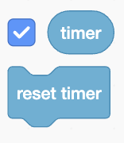

## Tree management

The rate at which new trees grow depends on a number of factors, such as climate conditions, soil quality, disease, sunlight, and water. Add a slider to demonstrate how managing these conditions can impact the number of trees in the area. 

The growing speed will be held in a `variable`{:class="block3variables"} called `tree management`{:class="block3variables"}.

--- task ---

To create a new variable, click on the `Variables`{:class="block3variables"} blocks menu.

Then click on the **Make a Variable** button.

You can give your `variable`{:class="block3variables"} a name. Call it `tree management`.


--- /task ---

Your new `variable`{:class="block3variables"} is visible on the Stage. Next, create a slider to control the speed in your simulation.

--- task ---

On the Stage, right-click on the `tree management`{:class="block3variables"} variable, and a menu will appear.

Select **slider** in the menu.


--- /task ---

At the moment, the `tree management`{:class="block3variables"} range is too wide.

--- task ---

On the Stage, right-click on the **tree management** slider and select **change slider range**.


Change the range to between `0` and `5`.


--- /task ---

In the simulation, the **tree management** slider controls the speed that new trees grow. If you move the slider to the right, it speeds up the growth; if you move it to the left, it slows down the growth. 

Add a set of blocks to make sure that the speed that new trees grow is in reaction to a change in the **tree management** slider.  

--- task ---

Go to the `Sensing`{:class="block3sensing"} blocks menu, and click on the checkbox next to the `timer`{:class="block3sensing"} block to show the timer on the Stage. 



Click on the green flag and you'll notice the timer starts to count up immediately. Click on the checkbox again to hide the timer from view. 

--- /task ---

Reset the timer to zero each time the flag is clicked.

--- task ---

Insert a `reset timer`{:class="block3sensing"} block into your `when green flag clicked`{:class="block3events"} script for the **Tree** sprite, so that the timer resets each time a new tree is cloned: 


```blocks3
when flag clicked
hide
forever
go to x:(pick random (-150) to (200)) y:(pick random (-120) to (120))
+reset timer
create clone of [myself v]
end
```

--- /task ---

Create a quick response to the slider so that the user immediately sees the impact of their interaction. Set up a loop that checks the **tree management** slider value frequently and adjusts the speed before cloning another tree.

--- task ---

Insert a `repeat until`{:class="block3control"} block with the condition `timer`{:class="block3sensing"} `>`{:class="block3operators"} `6` `-`{:class="block3operators"} `tree management`{:class="block3variables"}. Place it within the `forever`{:class="block3control"} loop.


```blocks3
when flag clicked
hide
forever
go to x:(pick random (-150) to (200)) y:(pick random (-120) to (120))
reset timer
+repeat until {{(timer)>((6)-(tree management))}}
end
create clone of [myself v]
end
```

--- /task ---

--- task ---

Within the `repeat until`{:class="block3control"} block, add a `wait 1 seconds`{:class="block3control"} block.


```blocks3
when flag clicked
hide
forever
go to x:(pick random (-150) to (200)) y:(pick random (-120) to (120))
reset timer
repeat until {{(timer)>((6)-(tree management))}}
+wait (1) seconds
end
create clone of [myself v]
end
```

--- /task ---

--- task ---

Test your simulation again. The **tree management** slider should control the speed that new trees grow.


--- /task ---

--- save ---
