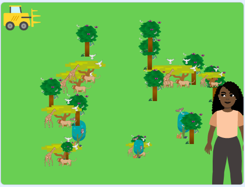

## कुछ पेड़ उगाओ

क्या आप जानते हैं कि पेड़ पृथ्वी की सतह के 30 प्रतिशत हिस्से को ढकते हैं? जिस तरह से हम अभी अपने स्थानीय पेड़ों की देखभाल करते हैं, उसका हमारे ग्रह के भविष्य पर प्रभाव पड़ेगा। इस चरण में, आप विभिन्न प्रकार के वृक्षों के साथ पेड़ों का एक क्षेत्र बनाने के लिए कोड जोड़ेंगे।

--- task ---

**ऑनलाइन**: Scratch में [स्टार्टर प्रोजेक्ट](http://rpf.io/tree-life-simulator-on){:target="_blank"} खोलें ।

**ऑफ़लाइन:** Scratch के ऑफ़लाइन संपादक में [प्रोजेक्ट स्टार्टर फ़ाइल](http://rpf.io/p/hi-IN/tree-life-simulator-get){:target="_blank"} खोलें। यदि आपको ज़रूरत है तो, आप [यहां Scratch डाउनलोड और इंस्टॉल ](https://scratch.mit.edu/download){:target="_blank"} कर सकते हैं

आपको हरे घास के मैदान की पृष्ठभूमि देखनी चाहिए।


--- /task ---

Scratch में, आप एक स्प्राइट की 300 कॉपी तक बना सकते हैं! इसे **क्लोनिंग (कॉपी बनाना)** कहा जाता है । आपका काम **Tree** स्प्राइट में कोड जोड़ना है ताकि यह मंच पर खुद के कॉपी (क्लोन) बना सके।

--- task ---

स्प्राइट्स पेन पर जाएं, और **Tree** स्प्राइट पर क्लिक करें। `when green flag clicked`{:class="block3events"} ब्लॉक और एक `forever`{:class="block3control"} ब्लॉक अपने Code क्षेत्र में खीचें `forever`{:class="block3control"} ब्लॉक के भीतर,`go to x:`{:class="block3motion"} `0` `y:`{:class="block3motion"} `0` ब्लॉक जोड़ें और एक `create clone of myself`{:class="block3control"}ब्लॉक:


```blocks3
when flag clicked
forever
go to x:(0) y:(0)
create clone of [myself v]
end
```

--- /task ---

इसके बाद, क्लोन किए गए पेड़ों को पूरे Stage पर मनचाही स्थिति में रोपित करें।

--- task ---

दोनों `x:`{:class="block3motion"} और `y:`{:class="block3motion"} मानों में एक `pick random`{:class="block3operators"} ब्लॉक जोड़ें ताकि पेड़ कहाँ उग रहे हैं यह अलग अलग हो। `x:`{:class="block3motion"} निर्देशांक को `pick random`{:class="block3operators"} `-150` `to`{:class="block3operators"} `200` में बदलें। `y:`{:class="block3motion"} निर्देशांक को `pick random`{:class="block3operators"} `-120` `to`{:class="block3operators"} `120` में बदलें।:


```blocks3
when flag clicked
forever
+ go to x:(pick random (-150) to (200)) y:(pick random (-120) to (120))
create clone of [myself v]
end
```

--- /task ---

यह महत्वपूर्ण है कि आप विभिन्न प्रकार के जानवरों को रखने, पर्यावरण को बहाल करने और लोगों को लाभान्वित करने के लिए विभिन्न प्रकार के पेड़ लगाएं। उदाहरण के लिए, एक कोआला ऑस्ट्रेलिया में चौड़ी पत्ती वाले सदाबहार पर निर्भर करता है, जबकि मैडागास्कर में पाये जाने वाले लीमर को द्वीप पर उगने वाले पर्णपाती पेड़ों की आवश्यकता होती है।

**Tree** स्प्राइट के पास तीन पोशाकें होती हैं:: **tree 1**, **tree 2** और **tree 3**। उन्हें देखने के लिए **Costumes** टैब पर क्लिक करें।

**Code** टैब पर वापस क्लिक करें और `random`{:class="block3operators"} ऑपरेटर का उपयोग करके पेड़ों का रूप बदल दें और क्षेत्र में विविधता जोड़ें।

--- task ---

`when I start as a clone`{:class="block3control"} ब्लॉक के साथ एक नई स्क्रिप्ट प्रारंभ करें। उसके नीचे एक `switch costume to`{:class="block3looks"} ब्लॉक जोड़ें। `pick random 1 to 10`{:class="block3operators"} ब्लॉक को `switch costume to`{:class="block3looks"} ब्लॉक में खींच कर लाएँ। मानों को `1` और `10` से `1` और `3` में बदलें:


```blocks3
when I start as a clone
switch costume to (pick random (1) to (3))
```

--- /task ---

--- task ---

हरे झंडे पर क्लिक करके अपने सिमुलेशन का परीक्षण करें। सुनिश्चित करें कि आपके पास विभिन्न प्रकार के पेड़ हैं।



--- /task ---

पेड़ न केवल पूर्ण विकसित दिखाई देते हैं, वे समय के साथ बड़े हो जाते हैं। आपको एक `repeat until`{:class="block3control"} लूप सेट करने की आवश्यकता है ताकि आप पेड़ के आकर तो तब तक बदल सकें जब तक कि उसका आकार 20 प्रतिशत के बराबर न हो जाए।

--- task ---

`set size to 100`{:class="block3looks"} (percent) ब्लॉक प्राप्त करें, लेकिन इसका मान `0` में बदलें ताकि **Tree** स्प्राइट शून्य से शुरू हो। एक `repeat until`{:class="block3control"} ब्लॉक अपनी स्क्रिप्ट के नीचे जोड़ें और उसके अंदर एक `=`{:class="block3operators"} ब्लॉक खींच के लाएँ। `size`{:class="block3looks"} `=`{:class="block3operators"} `20` शर्त जोड़ें:


```blocks3
when I start as a clone
switch costume to (pick random (1) to (3))
+ set size to (0)%
+ repeat until {(size)=[20]}
end
```

--- /task ---

पेड़ का आकार बदलें और उसके बढ़ने की प्रतीक्षा करें।

--- task ---

लूप के भीतर एक `change size by 10`{:class="block3looks"} ब्लॉक जोड़ें और उसका मान `1` में बदलें। `wait 1 seconds`{:class="block3control"} ब्लॉक जोड़ें और मान को `0.1` बदलें ताकि यह जल्दी जल्दी बदले:


```blocks3
when I start as a clone
switch costume to (pick random (1) to (3))
set size to (0)%
repeat until {(size)=[20]}
+ change size by (1)
+ wait (0.1) seconds
end
```

--- /task ---

--- task ---

अपने सिमुलेशन का फिर से परीक्षण करें। आपके पेड़ तो बढ़ेंगे, लेकिन आपका अगला क्लोन जहां भी बढ़ रहा है, वहां एक पूर्ण विकसित पेड़ भी दिखाई देता है।

--- /task ---

पेड़ को तब तक छुपाएं जब तक कि वह एक नया क्लोन शुरू न कर दे।

--- task ---

`when green flag clicked`{:class="block3events"} स्क्रिप्ट के शुरू पर `hide`{:class="block3looks"} ब्लॉक जोड़ें, और `when I start as a clone`{:class="block3control"} स्क्रिप्ट के शुरू पर `show`{:class="block3looks"} ब्लॉक।

```blocks3
when flag clicked
+ hide
forever
go to x:(pick random (-150) to (200)) y:(pick random (-120) to (120))
create clone of [myself v]
end
```

```blocks3
when I start as a clone
+ show
switch costume to (pick random (1) to (3))
set size to (0)%
repeat until {(size)=[20]}
change size by (1)
wait (0.1) seconds
end
```

--- /task ---

--- task ---

अपने सिमुलेशन का फिर से परीक्षण करें। आपके पेड़ अब वैसे ही बढ़ने चाहिए जैसे वे वास्तविक जीवन में बढ़ते।

--- /task ---

--- save ---
