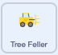
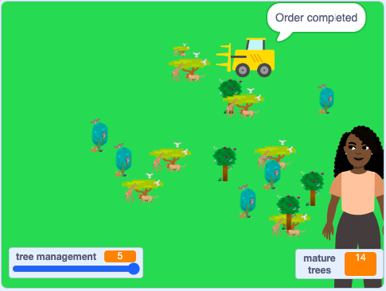

## ಮಾನವ ಅರಣ್ಯನಾಶ

ಮಾನವರು ಮರಗಳನ್ನು ಕಡಿಯಲು ಹಲವು ಕಾರಣಗಳಿವೆ. ಪೀಠೋಪಕರಣಗಳನ್ನು ರಚಿಸಲು, ಕಟ್ಟಡಗಳನ್ನು ಮಾಡಲು ಅಥವಾ ಉರುವಲುಗಳಾಗಿ ಸುಡಲು ಮರದ ಅಗತ್ಯವಿರಬಹುದು. ಪರ್ಯಾಯವಾಗಿ, ಅರಣ್ಯವು ಬಳಸುವ ಭೂಮಿ ಬೆಳೆಗಳನ್ನು ಬೆಳೆಯಲು, ದನಗಳನ್ನು ಮೇಯಿಸಲು ಅಥವಾ ಕಟ್ಟಡಗಳನ್ನು ನಿರ್ಮಿಸಲು ಬೇಕಾಗಬಹುದು.

ಈ ಹಂತದಲ್ಲಿ, ನೀವು ಅವಶ್ಯವಿರುವ ಮರಗಳ ಮೊತ್ತವನ್ನು ಪಡೆಯಲು ನೀವು **Tree Feller** ಸ್ಪ್ರೈಟ್‌ನ್ನು ಕೋಡ್‌ ಮಾಡುತ್ತೀರಿ ಮತ್ತು ಮಾನವ ಅರಣ್ಯನಾಶ ಮಾಡುತ್ತ ಅರಣ್ಯದಲ್ಲಿ ಚಲಿಸುತ್ತಿರಿ.

ಅದನ್ನು ಪ್ರತಿಬಾರಿ ಕ್ಲಿಕ್‌ ಮಾಡಿದಾಗ ಎಷ್ಟು ಮರಗಳು ಬೇಕು ಎಂದು ಕೇಳಲು **Tree Feller** ಸ್ಪ್ರೈಟ್‌ನ್ನು ಕೋಡ್‌ ಮಾಡಿ.

--- task ---

**Tree Feller** ಸ್ಪ್ರೈಟ್‌ ಮೇಲೆ ಕ್ಲಿಕ್‌ ಮಾಡಿ ಮತ್ತು `when this sprite clicked`{:class="block3events"} ಬ್ಲಾಕ್‌ನೊಂದಿಗೆ ಹೊಸ ಬರಹ ಪ್ರಾರಂಭಿಸಿ. `ask What is your name? and wait`{:class="block3sensing"} ನ್ನು ಸೇರಿಸಿ ಬ್ಲಾಕ್‌ ಸೇರಿಸಿ ಮತ್ತು `How many trees are needed? (max 20)` ಕೇಳಲು ಪಠ್ಯವನ್ನು ಬದಲಾಯಿಸಿ,:



```blocks3
when this sprite clicked
ask [How many trees are needed? (max 20)] and wait
```

--- /task ---

ಮುಂದೆ, ಪ್ರಶ್ನೆಯನ್ನು ಕೇಳುವುದರಿಂದ ಇನ್‌ಪುಟ್ ಅನ್ನು ಹಿಡಿದಿಡಲು ನಿಮಗೆ ವೇರಿಯಬಲ್ ಅಗತ್ಯವಿದೆ `How many trees are needed?(max 20)`.

--- task ---

ಹೊಸ `variable`{:class="block3variables"} ನ್ನು ರಚಿಸಿ ಮತ್ತು ಅದನ್ನು `trees needed` ಎಂದು ಕರೆಯಿರಿ.

--- /task ---

ಪ್ರತಿಬಾರಿ ಯಾರಾದರೂ ಹೆಚ್ಚು ಮರಗಳಿಗೆ ಮನವಿಯನ್ನು ಸಲ್ಲಿಸಿದಾಗ, **Tree Feller** ಸ್ಪ್ರೈಟ್‌ ಆ ಸಂಖ್ಯೆಯನ್ನು ಅವಶ್ಯವಿರುವ ಮರಗಳ ಮೊತ್ತಕ್ಕೆ ಸೇರಿಸಬೇಕು.

--- task ---

`trees needed`{:class="block3variables"} ವೇರಿಯೇಬಲ್‌ನಲ್ಲಿ ನಿಮ್ಮ ಪ್ರಶ್ನೆಯ ಉತ್ತರವನ್ನು ಸಂಗ್ರಹಣೆ ಮಾಡಲು, `change trees needed by 1`{:class="block3variables"} ಬ್ಲಾಕ್‌ನ್ನು ಸೇರಿಸಿ ಮತ್ತು `answer`{:class="block3sensing"} ಬ್ಲಾಕ್‌ನ್ನು ಅದು `1`{:class="block3variables"} ಎಂದು ಹೇಳುತ್ತದೆಯೋ ಅಲ್ಲಿಗೆ ಎಳೆಯಿರಿ:


```blocks3
when this sprite clicked
ask [How many trees are needed?] and wait
+ change [trees needed v] by (answer)
```

--- /task ---

ಮರಗಳು ದೊಡ್ಡದು ಮತ್ತು ಭಾರವಾಗಿರುವುದರಿಂದ, ಮನವಿಮಾಡಿಕೊಳ್ಳಬಹುದಾದ ಗರಿಷ್ಠ ಸಂಖ್ಯೆಯನ್ನು 20 ಕ್ಕೆ ಹೊಂದಿಸಬೇಕು.

--- task ---

`trees needed`{:class="block3variables"} `greater than`{:class="block3operators"} `20` ಷರತ್ತಿನೊಂದಿಗೆ `if ... then`{:class="block3control"} ಬ್ಲಾಕ್‌ನ್ನು ನಿಮ್ಮ ಕೋಡ್‌ನ ಕೊನೆಯಲ್ಲಿ ಸೇರಿಸಿ . `if ... then`{:class="block3control"} ಬ್ಲಾಕ್‌ ಒಳಗಡೆ, `set trees needed to`{:class="block3variables"} `20` ನ್ನು ಸೇರಿಸಿ:


```blocks3
when this sprite clicked
ask [How many trees are needed?] and wait
change [trees needed v] by (answer)
+ if {(trees neeed) > (20)} then
set (trees needed v) to (20)
end
```

--- /task ---

ಪ್ರತಿಬಾರಿ ಸಾದೃಶ್ಯವನ್ನು ಪ್ರಾರಂಭಿಸಲು ಹಸಿರು ಬಾವುಟವನ್ನು ಕ್ಲಿಕ್‌ ಮಾಡಿದಾಗ ಅವಶ್ಯವಿರುವ ಮರಗಳ ಸಂಖ್ಯೆಯನ್ನು ಮರುಹೊಂದಿಸಿ, ಅದರಿಂದ ಅದು ವೇರಿಯೇಬಲ್‌ನ್ನು ಖಾಲಿ ಮಾಡಿ ಹೊಸ ಮನವಿಗೆ ಸಿದ್ಧಪಡಿಸುತ್ತದೆ.

--- task ---

`when green flag clicked`{:class="block3control"} ಬ್ಲಾಕ್‌ನೊಂದಿಗೆ ಹೊಸ ಬರಹವನ್ನು ಪ್ರಾರಂಭಿಸಿ ಮತ್ತು `set trees needed to 0`{:class="block3variables"} ಬ್ಲಾಕ್‌ನ್ನು ಸೇರಿಸಿ:


```blocks3
when flag clicked
set [trees needed v] to (0)
```

--- /task ---

--- task ---

ನಿಮ್ಮ ಸಾದೃಶ್ಯವನ್ನು ರನ್‌ ಮಾಡಿ. **Tree Feller** ಸ್ಪ್ರೈಟ್‌ ಮೇಲೆ ಕ್ಲಿಕ್‌ ಮಾಡಿ ಮತ್ತು ಮರಗಳ ಸಂಖ್ಯೆಗಳನ್ನು ಮನವಿ ಮಾಡಿ. ಪ್ರತಿಬಾರಿ `trees needed`{:class="block3variables"} ವೇರಿಯೇಬಲ್‌ಗೆ ಏನಾಗುತ್ತದೆ ಎಂದು ನೋಡಲು ಬೇರೆ ಬೇರೆ ಸಂಖ್ಯೆಗಳನ್ನು ಎಂಟರ್‌ ಮಾಡಿ.

--- /task ---

**Tree Feller** ಸ್ಪ್ರೈಟ್‌ ಪ್ರೌಢ ಮರವನ್ನು ಸ್ಪರ್ಶಿಸಿದಾಗ, ಅವಶ್ಯವಿರುವ ಮರಗಳ ಸಂಖ್ಯೆ ಕಡಿಮೆಯಾಗುತ್ತದೆ.

--- task ---

**Tree** ಸ್ಪ್ರೈಟ್‌ ಮೇಲೆ ಕ್ಲಿಕ್‌ ಮಾಡಿ ಮತ್ತು `change trees needed by`{:class="block3variables"} `-1` ನ್ನು ಅದು `touches Tree Feller`{:class="block3sensing"} ನಂತರ ಬರಹಕ್ಕೆ ಸೇರಿಸಿ.

`wait until`{:class="block3control"} ಬ್ಲಾಕ್‌ನ ಷರತ್ತನ್ನು `touches Tree Feller`{:class="block3sensing"} `and`{:class="block3operators"} `trees needed`{:class="block3variables"} `>`{:class="block3operators"} `0` ಆಗುವಂತೆ ಬದಲಾಯಿಸಿ


```blocks3
when I start as a clone
show
switch costume to (pick random (1) to (3))
set size to (0)%
repeat until {(size)=[20]}
change size by (1)
wait (0.1) seconds
end
change (mature trees) by (1)
+ wait until {{touching [Tree Feller v]?} and {(trees needed)>(0)}}
+ change (trees needed) by (-1)
change (mature trees) by (-1)
delete this clone
```

--- /task ---

ಬಹಳಷ್ಟು `variables`{:class="block3variables"} ಗಳಿಂದ Stage ಕಿಕ್ಕಿರಿದಿರುವಂತೆ ಕಾಣಿಸುತ್ತಿದೆ. ಅವುಗಳು ನಿಮ್ಮ ಸಾದೃಶ್ಯದಲ್ಲಿ ಉತ್ತಮ ಸ್ಥಳಗಳಲ್ಲಿ ಕಾಣುವಂತೆ ಅವುಗಳನ್ನು ಇರಿಸಿ ಮತ್ತು ಮರ ನಿರ್ವಹಣೆಗೆ ಸಂಬಂಧಿಸಿದ ಮೌಲ್ಯಗಳನ್ನು ತೋರಿಸದೇ ಇರುವವುಗಳನ್ನು ಮರೆಮಾಡಿ.

--- task ---

`Variables`{:class="block3variables"} ಬ್ಲಾಕ್‌ಗಳ ಮೆನುಗೆ ಹೋಗಿ ಮತ್ತು `trees needed`{:class="block3variables"} ವೇರಿಯೇಬಲ್‌ನ್ನು ಅನ್‌ಟಿಕ್‌ ಮಾಡಿ.

**tree management** ಸ್ಲೈಡರ್‌ ವೇರಿಯೇಬಲ್‌ನ್ನು ಮತ್ತು **mature trees** ಕೌಂಟರ್‌ ವೇರಿಯೇಬಲ್‌ನ್ನು Stage ನ ಕೆಳ ಮೂಲಗೆ ಎಳೆಯಿರಿ.


--- /task ---

ಪ್ರತಿಯೊಂದು ಬಾರಿ ಸಾದೃಶ್ಯ ಪ್ರಾರಂಭವಾದಾಗ **Tree Feller** ಸ್ಪ್ರೈಟ್‌ಗೆ ಪ್ರಾರಂಭಿಕ ಸ್ಥಾನವನ್ನು ಹೊಂದಿಸಿ.

--- task ---

**Tree Feller** ಸ್ಪ್ರೈಟ್‌ ಮೇಲೆ ಕ್ಲಿಕ್‌ ಮಾಡಿ ಮತ್ತು `when green flag clicked`{:class="block3events"} ಬರಹದಲ್ಲಿ, `set rotation style left-right`{:class="block3motion"} ಬ್ಲಾಕ್‌ನ್ನು ಒಳಸೇರಿಸಿ, ಅದರಿಂದ **Tree Feller** ಸ್ಪ್ರೈಟ್‌ ತಲೆಕೆಳಗಾಗಿ ತಿರುಗುವುದಿಲ್ಲ. **Tree Feller** ಸ್ಪ್ರೈಟ್‌ ಮೇಲಿನ ಎಡ ಮೂಲೆಯಲ್ಲಿ ಪ್ರಾರಂಭಿಸುವಂತೆ ಮಾಡಲು, `go to x:0 y:0`{:class="block3motion"} ಬ್ಲಾಕ್‌ ಸೇರಿಸಿ ಮತ್ತು ಮೌಲ್ಯಗಳನ್ನು `-200` ಮತ್ತು `150` ಕ್ಕೆ ಬದಲಾಯಿಸಿ. ಸ್ಪ್ರೈಟ್ `point in direction 90`{:class="block3motion"}‌ ಮಾಡುವಂತೆ ಮಾಡಲು:


```blocks3
when flag clicked
set [trees needed v] to (0)
+ set rotation style [left-right v]
+ go to x: (-200) y: (150)
+ point in direction (90)
```

--- /task ---

**Tree Feller** ಸ್ಪ್ರೈಟ್‌ ಅರಣ್ಯದಲ್ಲಿ ಎಡದಿಂದ ಬಲಕ್ಕೆ ಮತ್ತೆ ಅಲ್ಲಿಂದ ಹಿಂದಕ್ಕೆ ಅದು ಸಾಕಷ್ಟು ಮರಗಳನ್ನು ಕಡಿಯುವವರೆಗೆ ಚಲಿಸುತ್ತದೆ. ಅವಶ್ಯವಿರುವ ಮರಗಳ ಸಂಖ್ಯೆ ಸೊನ್ನೆಯಾದಾಗ **Tree Feller** ಸ್ಪ್ರೈಟ್‌ಗೆ ಅದು ಸಾಕಷ್ಟು ಮರಗಳನ್ನು ಸಂಗ್ರಹಿಸಿದೆ ಎಂದು ತಿಳಿಸಲು ಆಪರೇಟರ್‌ನ್ನು ಉಪಯೋಗಿಸಿ.

--- task ---

`when this sprite clicked`{:class="block3events"} ಬರಹದಲ್ಲಿ, `repeat until`{:class="block3control"} ಬ್ಲಾಕ್‌ನ್ನು ಸೇರಿಸಿ ಮತ್ತು ಒಂದು ಬರೋಬ್ಬರಿ `=`{:class="block3operators"} ಬ್ಲಾಕ್‌ನ್ನು ಒಳಕ್ಕೆ ಎಳೆಯಿರಿ. `trees needed`{:class="block3variables"} `=`{:class="block3operators"} `0` ಷರತ್ತನ್ನು ಸೇರಿಸಿ.

ಲೂಪ್‌ ಒಳಗೆ, `move 10 steps`{:class="block3motion"} ಬ್ಲಾಕ್‌ ಸೇರಿಸಿ ಮತ್ತು ಮೌಲ್ಯವನ್ನು `4` ಕ್ಕೆ ಬದಲಾಯಿಸಿ:


```blocks3
when this sprite clicked
ask [How many trees are needed? (max 20)] and wait
change [trees needed v] by (answer)
if {(trees needed) > (20)} then
set (trees needed v) to (20)
end
+ repeat until {(trees needed) = (0)}
move (4) steps
end
```

--- /task ---

--- task ---

ನಿಮ್ಮ ಸಾದೃಶ್ಯವನ್ನು ರನ್‌ ಮಾಡಿ. **Tree Feller** ಸ್ಪ್ರೈಟ್‌ ಮೇಲೆ ಕ್ಲಿಕ್‌ ಮಾಡಿ ಮತ್ತು ಮರಗಳ ಸಂಖ್ಯೆಗಳನ್ನು ಮನವಿ ಮಾಡಿ. **Tree Feller** ಸ್ಪ್ರೈಟ್‌ ಸಂಪೂರ್ಣ Stage ಮೂಲಕ ಚಲಿಸುತ್ತದೆಯೇ?

--- /task ---

ಈ ಸಮಯದಲ್ಲಿ, **Tree Feller** ಸ್ಪ್ರೈಟ್‌ Stage ನ ಮೇಲ್ಭಾಗದ ಉದ್ದಕ್ಕೂ ಚಲಿಸುತ್ತದೆ. ಸ್ಪ್ರೈಟ್‌ Stage ನ ಅಂಚನ್ನು ಸ್ಪರ್ಶಿಸುತ್ತಿದೆಯೇ ಎಂದು ಅದು ಗ್ರಹಿಸುವಂತೆ ಮಾಡಬೇಕು, ಅದರಿಂದ ಅದಕ್ಕೆ ದಿಕ್ಕನ್ನು ಬದಲಾಯಿಸಬೇಕು ಎಂದು ತಿಳಿಯುತ್ತದೆ.

--- task ---

`touching edge`{:class="block3sensing"} ಷರತ್ತಿನೊಂದಿಗೆ `if ... then`{:class="block3control"} ಬ್ಲಾಕ್‌ ಸೇರಿಸಿ. ನಿಮ್ಮ `if`{:class="block3control"} ಲೂಪ್‌ ಒಳಗೆ,ಎರಡು `Motion`{:class="block3motion"}ಬ್ಲಾಕ್‌ಗಳನ್ನು ಸೇರಿಸಿ:  `turn right by`{:class="block3motion"} `180` `degrees`{:class="block3motion"} ಮತ್ತು `change y by`{:class="block3motion"} `-40`:


```blocks3
when this sprite clicked
ask [How many trees are needed? (max 20)] and wait
change [trees needed v] by (answer)
if {(trees needed) > (20)} then
set (trees needed v) to (20)
end
repeat until {(trees needed) = (0)}
move (4) steps
+ if {touching [edge v]?} then
turn right (180) degrees
change y by (-40)
end
end
```

--- /task ---

**Tree Feller** ಸ್ಪ್ರೈಟ್‌ ಸ್ಟೇಜ್‌ನ ಕೆಳಭಾಗವನ್ನು ತಲುಪಿದರೆ, ಅದು ಮತ್ತೆ ಮೇಲಿನಿಂದ ಪ್ರಾರಂಭಿಸಬೇಕು.

--- task ---

`y position`{:class="block3motion"} `<`{:class="block3operators"} `-120` ಷರತ್ತಿನೊಂದಿಗೆ ಇನ್ನೊಂದು `if ... then`{:class="block3control"} ಬ್ಲಾಕ್‌ ಸೇರಿಸಿ. ನಿಮ್ಮ `if ... then`{:class="block3control"} ಲೂಪ್‌ ಒಳಗೆ, `go to x:`{:class="block3motion"} `-200` `y:`{:class="block3motion"} `150` ನ್ನು ಸೇರಿಸಿ ಅದರಿಂದ ಅದು ಪ್ರಾರಂಭಿಕ ಸ್ಥಾನಕ್ಕೆ ಮರಳುತ್ತದೆ:


```blocks3
when this sprite clicked
ask [How many trees are needed? (max 20)] and wait
change [trees needed v] by (answer)
if {(trees needed) > (20)} then
set (trees needed v) to (20)
end
repeat until {(trees needed) = (0)}
move (4) steps
if {touching [edge v]?} then
turn right (180) degrees
change y by (-40)
end
+ if {(y position)<(-120)} then
go to x: (-200) y: (150)
end
end
```

--- /task ---

ನಂತರ, ನೀವು **Tree Feller** ಸ್ಪ್ರೈಟ್‌ ಯಾವಾಗ ಸಾಕಷ್ಟು ಮರಗಳನ್ನು ಕಡಿದಿದೆ ಎಂದು ಪತ್ತೆ ಮಾಡಬೇಕು. **Tree Feller** ಸ್ಪ್ರೈಟ್‌ ಅದು ಮನವಿಗಳನ್ನು ಮುಗಿಸಿದೆ ಎಂದು ಘೋಷಿಸುವಂತೆ ಮಾಡಬೇಕು.

--- task ---

`Looks`{:class="block3looks"} ಬ್ಲಾಕ್‌ನ್ನು ನಿಮ್ಮ ಕೋಡ್‌ನ ಕೊನೆಯಲ್ಲಿ ಸೇರಿಸಿ ಅದರಿಂದ **Tree Feller** ಸ್ಪ್ರೈಟ್ `say`{:class="block3looks"} `Requests completed.` `for 2 seconds`{:class="block3looks"}‌ ಮಾಡುತ್ತದೆ:


```blocks3
when this sprite clicked
ask [How many trees are needed? (max 20)] and wait
change [trees needed v] by (answer)
if {(trees needed) > (20)} then
set (trees needed v) to (20)
end
repeat until {(trees needed) = (0)}
move (4) steps
if {touching [edge v]?} then
turn right (180) degrees
change y by (-40)
end
if {(y position)<(-120)} then
go to x: (-200) y: (150)
end
end
+ say [Requests completed.] for (2) seconds
```

--- /task ---

--- task ---

ನಿಮ್ಮ ಸಾದೃಶ್ಯವನ್ನು ರನ್‌ ಮಾಡಿ. **Tree Feller** ಸ್ಪ್ರೈಟ್‌ ಮೇಲೆ ಕ್ಲಿಕ್‌ ಮಾಡಿ ಮತ್ತು ಮರಗಳ ಸಂಖ್ಯೆಗಳನ್ನು ಮನವಿ ಮಾಡಿ. ಒಮ್ಮೆ **Tree Feller** ಸ್ಪ್ರೈಟ್‌ ಸಾಕಷ್ಟು ಮರಗಳನ್ನು ಸಂಗ್ರಹಿಸಿದ ನಂತರ, ಅದು ಮುಗಿಸಿದೆ ಎಂದು ನಿಮಗೆ ಹೇಳುತ್ತದೆ.

--- /task ---

ಒಮ್ಮೆ ಮನವಿಗಳೆಲ್ಲಾ ಪೂರ್ಣಗೊಂಡಾಗ,, **Tree Feller** ಸ್ಪ್ರೈಟ್‌ ಮುಂದಿನ ಮನವಿಗೆ ಸಿದ್ಧವಾಗಿ ಮರದ ಪ್ರದೇಶದಿಂದ ಪಕ್ಕಕ್ಕೆ ಚಲಿಸುವಂತೆ ಮಾಡಿ.

--- task ---

`Motion`{:class="block3motion"} ಬ್ಲಾಕ್‌ಗಳನ್ನು ಸೇರಿಸಿ: `set x to`{:class="block3motion"} `-200` ಬ್ಲಾಕ್ ಮತ್ತು `point in direction 90`{:class="block3motion"} ಬ್ಲಾಕ್.


```blocks3
when this sprite clicked
ask [How many trees are needed? (max 20)] and wait
change [trees needed v] by (answer)
if {(trees needed) > (20)} then
set (trees needed v) to (20)
end
repeat until {(trees needed) = (0)}
move (4) steps
if {touching [edge v]?} then
turn right (180) degrees
change y by (-40)
end
if {(y position)<(-120)} then
go to x: (-200) y: (150)
end
end
say [Requests completed.] for (2) seconds
+ set x to (-200)
+ point in direction (90)
```

--- /task ---

--- task ---

ನಿಮ್ಮ ಸಾದೃಶ್ಯವನ್ನು ಪರೀಕ್ಷಿಸಿ. ಬೇರೆ ಬೇರೆ ಮೊತ್ತದ ಕಟ್ಟಿಗೆಗಳನ್ನು ಮನವಿಮಾಡಲು **Tree Feller** ಸ್ಪ್ರೈಟ್‌ ಮೇಲೆ ಕೆಲವು ಬಾರಿ ಕ್ಲಿಕ್ ಮಾಡಿ.



--- /task ---

--- save ---
