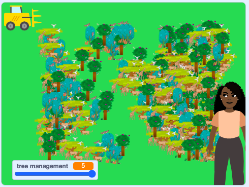

## वृक्ष व्यवस्थापन

नवीन झाडांच्या वाढीचा दर विविध घटकांवर अवलंबून असतो, जसेकी, हवामान स्थिती, मातीचा दर्जा, आजार, सुर्यप्रकाश, आणि पाणी. या टप्प्यात, हे स्थिती व्यवस्थापन केल्याने एरियामधील झाडांच्या संख्येवर परिणाम कसा होतो हे दर्शविण्यासाठी तुम्ही स्लाइडर जोडाल.

वाढता वेग `variable`{:class="block3variables"} मध्ये धरला जाईल ज्याला `tree management`{:class="block3variables"} म्हणतात.

--- task ---

नवीन व्हेरिएबल तयार करण्यासाठी `Variables`{:class="block3variables"} ब्लॉक्स मेनूवर क्लिक करा.

त्यानंतर **Make a Variable** बटनवर क्लिक करा.

तुम्ही तुमचे `variable`{:class="block3variables"} नाव देऊ शकता. त्याला `वृक्ष व्यवस्थापन` म्हणा.

--- /task ---

तुमचा नवीन `variable`{:class="block3variables"} Stage वर दिसण्यायोग्य आहे. पुढे, तुमच्या सिम्युलेशन मध्ये वेग नियंत्रीत करण्यासाठी स्लाइडर तयार करा.

--- task ---

Stage वर, `tree management`{:class="block3variables"} व्हेरिएबलवर राईट-क्लिक करा, आणि मेनू दिसेल.

मेनूमध्ये **slider** निवडा.

--- /task ---

याक्षणी, `tree management`{:class="block3variables"} रेंज खूप मोठी आहे.

--- task ---

Stage वर, **tree management** स्लाइडरवर राईट-क्लिक करा आणि **change slider range** निवडा.

रेंज `0` आणि `5` दरम्यान बदला.

--- /task ---

सिम्युलेशन मध्ये, **tree management** स्लाइडर नवीन झाड वाढणाऱ्या वेगाला नियंत्रीत करतो. तुम्ही स्लाइडरला उजवीकडे हलवले तर, तो वाढण्याचा वेग वाढवेल; तुम्ही ते डावीकडे हलवले, तर त्याची वाढ हळूवार होईल.

स्लाइडर उजवीकडे असतांना (5), सिम्युलेशन झाड लावण्यासाठी एक सेकंद प्रतिक्षा करतो, आणि तो डावीकडे (0) असतांना, तो झाड लावण्यासाठी सहा सेकंद प्रतिक्षा करतो.

नवीन झाड वाढण्याचा वेग **tree management** स्लाइडर मधील बदलानूसार असण्याची खात्री करण्यासाठी तुम्ही ब्लॉक्सचा सेट जोडाल.

--- task ---

या कार्यात, `timer`{:class="block3sensing"} ब्लॉक कसा कार्य करतो हे तुम्ही बघाल. `Sensing`{:class="block3sensing"} ब्लॉक्स मेनूवर जा आणि Stage वर टाइमर दाखवण्यासाठी `timer`{:class="block3sensing"} ब्लॉकच्या पुढील चेकबॉक्सवर क्लिक करा.

हिरव्या झेंड्यावर क्लिक करा आणि तात्काळ काऊंट चालू करण्यासाठी टाइमरकडे तुम्ही लक्ष द्याल. टाइमर दिसण्यापासून लपवण्यासाठी पुन्हा चेकबॉक्सवर क्लिक करा.

--- /task ---

प्रत्येक वेळी झेंड्यावर क्लिक केल्यावर टाइमर शून्यावर रीसेट करा.

--- task ---

`reset timer`{:class="block3sensing"} ब्लॉक तुमच्या `when green flag clicked`{:class="block3events"} स्क्रिप्टमध्ये इंसर्ट करा **Tree** स्प्राईटसाठी, जेणेकरून प्रत्येक वेळी नवीन झाड क्लोन झाल्यावर टाइमर रीसेट होईल:


```blocks3
when flag clicked
hide
forever
go to x:(pick random (-150) to (200)) y:(pick random (-120) to (120))
+ reset timer
create clone of [myself v]
end
```

--- /task ---

स्लाइडरवर तात्काळ प्रतिसाद निर्माण करा जेणेकरून यूजरला त्यांच्या परस्पर संवादाचा परिणाम दिसेल. लूप सेट करा जो **tree management** स्लाइडर व्हॅल्यू वारंवार तपासतो आणि दुसऱ्या झाडाला क्लोन करण्याआधी वेग ऍडजस्ट करतो.

--- task ---

`repeat until`{:class="block3control"} ब्लॉक स्थितीसह इंसर्ट करा `timer`{:class="block3sensing"} `>`{:class="block3operators"} `6` `-`{:class="block3operators"} `tree management`{:class="block3variables"}.  `repeat until`{:class="block3control"} ब्लॉक मध्ये `wait 1 seconds`{:class="block3control"} ब्लॉक जोडा:


```blocks3
when flag clicked
hide
forever
go to x:(pick random (-150) to (200)) y:(pick random (-120) to (120))
reset timer
+ repeat until {{(timer)>((6)-(tree management))}}
wait (1) seconds
end
create clone of [myself v]
end
```

--- /task ---

--- task ---

तुमच्या सिम्युलेशनची पुन्हा चाचणी करा. **tree management** स्लाइडरने नवीन झाडाच्या वाढीचा वेग नियंत्रीत करायला हवा.



--- /task ---

--- save ---
