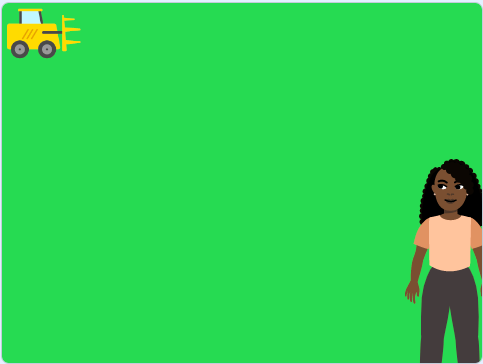

## కొన్ని చెట్లను పెంచండి

భూమి యొక్క భూ ఉపరితలంలో 30 శాతం చెట్లు ఆక్రమించాయని మీకు తెలుసా? మనం ఇప్పుడు మన స్థానిక చెట్లను చూసుకునే విధానం మన గ్రహం యొక్క భవిష్యత్తుపై ప్రభావం చూపుతుంది. ఈ దశలో, మీరు వివిధ రకాల చెట్లతో నిండిన ప్రాంతాన్ని సృష్టించడానికి కోడ్‌ని జోడిస్తారు.

--- task ---

**Online:** Scratch లో [స్టార్టర్ ప్రాజెక్ట్ ](http://rpf.io/tree-life-simulator-on){:target="_blank"} ని తెరవండి.

**Offline:** Scratch యొక్క ఆఫ్ లైన్ ఎడిటర్ లో [ప్రాజెక్టు స్టార్టర్ ఫైల్](http://rpf.io/p/te-IN/tree-life-simulator-get){:target="_blank"} ని తెరవండి. మీకు అవసరమైతే, మీరు [ఇక్కడ Scratch ను డౌన్ లోడ్ చేసి ఇన్‌స్టాల్ చేయవచ్చు.](https://scratch.mit.edu/download){:target="_blank"}.

మీరు ఆకుపచ్చ గడ్డి మైదానం నేపథ్యాన్ని చూడాలి.



--- /task ---

Scratchలో, మీరు ఒక స్ప్రైట్ యొక్క 300 కాపీల వరకు తయారు చేయవచ్చు! దీనిని **క్లోనింగ్**అంటారు. **Tree** sprite కు కోడ్‌ని జోడించడం మీ పని, తద్వారా అది Stage పై స్వయంగా క్లోన్‌లను సృష్టిస్తుంది.

--- task ---

Sprites పేన్‌కి వెళ్లి, **Tree** sprite పై క్లిక్ చేయండి. `when green flag clicked`{:class="block3events"} బ్లాక్‌ని మరియు `forever`{:class="block3control"} బ్లాక్‌ని మీ కోడ్ ప్రాంతంలోకి డ్రాగ్ చేయండి. `forever`:class="block3control"} బ్లాక్ లోపల, ఒక `go to x:`{:class="block3motion"} `0` `y:`{:class="block3motion"} `0` మరియు ఒక `create clone of myself`{:class="block3control"} బ్లాక్ ని జోడించండి:


```blocks3
when flag clicked
forever
go to x:(0) y:(0)
create clone of [myself v]
end
```

--- /task ---

తరువాత, Stage అంతటా యాదృచ్ఛిక స్థానాల్లో క్లోన్ చేసిన చెట్లను నాటండి.

--- task ---

చెట్లు వివిధ ప్రాంతాలలో పెరగడానికి, `x:`{:class="block3motion"} మరియు `y:`{:class="block3motion"} విలువలు రెండింటికీ `pick random`{:class="block3operators"} బ్లాక్‌ని జోడించండి. `x:`{:class="block3motion"} కోఆర్డినేట్‌లను `pick random`{:class="block3operators"} `-150` `నుండి`{:class="block3operators"} `200` కు మార్చండి. `y:`{:class="block3motion"} కోఆర్డినేట్‌లను `pick random`{:class="block3operators"} `-120` `to`{:class="block3operators"} `120` కు మార్చండి:


```blocks3
when flag clicked
forever
+ go to x:(pick random (-150) to (200)) y:(pick random (-120) to (120))
create clone of [myself v]
end
```

--- /task ---

అనేక రకాల జంతువులను నివాసం కల్పించడానికి, పర్యావరణాన్ని పునరుద్ధరించడానికి మరియు ప్రజలకు ప్రయోజనం చేకూర్చడానికి మీరు వివిధ రకాల చెట్లను నాటడం ముఖ్యం. ఉదాహరణకు, కోయలా ఆస్ట్రేలియాలోని విశాలమైన సతతహరితాలపై ఆధారపడుతుంది, అయితే మడగాస్కర్‌లోని లెమర్‌కు ద్వీపంలో పెరిగే ఆకురాల్చే చెట్లు అవసరం.

**Tree** sprite మూడు costumes లను కలిగి ఉంది: **tree 1**, **tree 2**, మరియు **tree 3**. వాటిని చూడటానికి **Costumes** ట్యాబ్‌పై క్లిక్ చేయండి.

**Code** ట్యాబ్‌ను తిరిగి క్లిక్ చేయండి మరియు చెట్ల రూపాన్ని మార్చడానికి మరియు ప్రాంతానికి విభిన్నతను జోడించడానికి `random`{:class="block3operators"} ఆపరేటర్‌ని ఉపయోగించండి.

--- task ---

`when i start as a clone`{:class="block3control"} బ్లాక్‌తో కొత్త స్క్రిప్ట్‌ను ప్రారంభించండి. దాని క్రింద `switch costume to`{:class="block3looks"} బ్లాక్‌ని జోడించండి. `pick random 1 to 10`{:class="block3operators"} బ్లాక్‌ని `switch costume to`{:class="block3looks"} బ్లాక్‌ లోనికి లాగండి. విలువలను `1` మరియు `10` నుండి `1` మరియు `3`కి మార్చండి:


```blocks3
when I start as a clone
switch costume to (pick random (1) to (3))
```

--- /task ---

--- task ---

ఆకుపచ్చ జెండాపై క్లిక్ చేయడం ద్వారా మీ సిమ్యులేషన్ ను పరీక్షించండి. మీకు రకరకాల చెట్లు ఉన్నాయని నిర్ధారించుకోండి.


--- /task ---

చెట్లు పూర్తిగా పెరిగినట్లు కనిపించవు, అవి కాలక్రమేణా పెద్దవిగా ఉంటాయి. మీరు `repeat until`{:class="block3control"} లూప్ ను సెటప్ చేయాల్సి ఉంటుంది, తద్వారా మీరు చెట్టు పెరిగే కొద్దీ దాని పరిమాణం 20 శాతానికి సమానం అయ్యే వరకు మార్చవచ్చు.

--- task ---

`set size to 100`{:class="block3looks"} (percent) బ్లాక్‌ని పొందండి, కానీ విలువను `0` కి మార్చండి, తద్వారా **Tree** sprite శూన్యం నుంచి ప్రారంభమవుతుంది. `repeat until`{:class="block3control"} బ్లాక్‌ని జోడించి, దాని లోపలకు `=`{:class="block3operators"} బ్లాక్‌ని లాగండి. `size`{:class="block3looks"} `=`{:class="block3operators"} `20` కండిషన్ ను జోడించండి:


```blocks3
when I start as a clone
switch costume to (pick random (1) to (3))
+ set size to (0)%
+ repeat until {(size)=[20]}
end
```

--- /task ---

చెట్టు పరిమాణాన్ని మార్చండి మరియు అది పెరిగేదాకా వేచి ఉండండి.

--- task ---

`change size by 10`{:class="block3looks"} బ్లాక్‌ను లూప్ లోపల జోడించి, విలువను `1`కి మార్చండి. `wait 1 seconds`{:class="block3control"} బ్లాక్‌ని జోడించి, విలువను `0.1` కి మార్చండి, తద్వారా ఇది త్వరగా మార్పు చెందుతుంది:


```blocks3
when I start as a clone
switch costume to (pick random (1) to (3))
set size to (0)%
repeat until {(size)=[20]}
+ change size by (1)
+ wait (0.1) seconds
end
```

--- /task ---

--- task ---

మీ సిమ్యులేషన్ ను మళ్లీ పరీక్షించండి. మీ చెట్లు పెరుగుతాయి, కానీ మీ తదుపరి క్లోన్ పెరుగుతున్న చోట పూర్తిగా పెరిగిన చెట్టు కూడా కనిపిస్తుంది.

--- /task ---

చెట్టు కొత్త క్లోన్‌ను ప్రారంభించే వరకు దానిని దాచండి.

--- task ---

మీ `when green flag clicked`{:class="block3events"} స్క్రిప్ట్ ప్రారంభానికి `hide`{:class="block3looks"} బ్లాక్‌ను జోడించండి మరియు `show`{:class="block3looks"} బ్లాకుని మీ `when I start as a clone`{:class="block3control"} స్క్రిప్ట్‌ యొక్క ప్రారంభానికి జోడించండి.

```blocks3
when flag clicked 
forever
+ go to x:(pick random (-150) to (200)) y:(pick random (-120) to (120)) 
Create clone of [myself v]
end
```

```blocks3
when I start as a clone
+ show
switch costume to (pick random (1) to (3))
set size to (0)%
repeat until {(size)=[20]}
change size by (1)
wait (0.1) seconds
end
```

--- /task ---

--- task ---

మీ సిమ్యులేషన్ ను మళ్లీ పరీక్షించండి. మీ చెట్లు ఇప్పుడు నిజ జీవితంలో లాగా పెరగాలి.

--- /task ---

--- save ---
