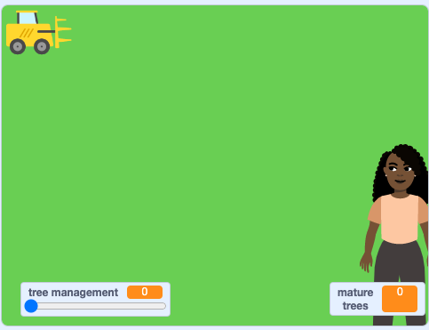

## మానవ అటవీ నిర్మూలన

మనుషులు చెట్లను నరకడానికి చాలా కారణాలున్నాయి. కలప ఫర్నిచర్ తయారు చేయడానికి, భవనాలు కట్డడానికి లేదా కట్టెలుగా కాల్చడానికి అవసరం కావచ్చు. ప్రత్యామ్నాయంగా, పంటలు పండించడానికి, పశువులను మేపడానికి లేదా భవనాలను నిర్మించడానికి అడవి ఉపయోగించే భూమి అవసరం కావచ్చు.

ఈ దశలో, మీరు **Tree Feller** sprite ను కోడ్ చేసి, అవసరమైన మొత్తం చెట్లను పొందడానికి మరియు మానవ అటవీ నిర్మూలనకు కారణమవుతూ అడవి గుండా వెళతారు.

**Tree Feller** sprite ని క్లిక్ చేసిన ప్రతిసారీ ఎన్ని చెట్లు అవసరమో అడగడానికి కోడ్ చేయండి.

--- task ---

**Tree Feller** sprite పై క్లిక్ చేసి, `when this sprite clicked`{:class="block3events"} బ్లాక్‌ తో కొత్త స్క్రిప్ట్‌ను ప్రారంభించండి. `ask What is your name? and wait`{:class="block3sensing"} బ్లాకుని జోడించండి మరియు `How many trees are needed? (max 20)` అని అడిగేలా మార్పు చేయండి:


```blocks3
when this sprite clicked
ask [How many trees are needed? (max 20)] and wait
```

--- /task ---

`How many trees are needed? (max 20)` ఈ ప్రశ్నకి వచ్చే సమాధానాన్ని పట్టుకోవడానికి,  తదుపరి మీకు వేరియబుల్ అవసరం

--- task ---

కొత్త `variable`{:class="block3variables"} ని సృష్టించండి మరియు దానిని `trees needed` అని పిలవండి.

--- /task ---

ఎవరైనా ఎక్కువ చెట్ల కోసం అభ్యర్థనను సమర్పించిన ప్రతిసారీ, **Tree Feller** sprite ఆ సంఖ్యను అవసరమైన చెట్ల మొత్తానికి జోడించాలి.

--- task ---

`trees needed`{:class="block3variables"} వేరియబుల్ లో మీ ప్రశ్నకు సమాధానం నిల్వ చేయడానికి, `change trees needed by 1`{:class="block3variables"} బ్లాకుని జోడించండి మరియు `1`{:class="block3variables"} అనబడే దాంట్లోకి  `answer`{:class="block3sensing"} బ్లాకుని డ్రాగ్ చేయండి.


```blocks3
when this sprite clicked
ask [How many trees are needed?] and wait
+ change [trees needed v] by (answer)
```

--- /task ---

చెట్లు పెద్దవి మరియు భారీగా ఉన్నందున, అభ్యర్థించగల గరిష్ట సంఖ్యను 20కి సెట్ చేయాలి.

--- task ---

`trees needed`{:class="block3variables"} `greater than`{:class="block3operators"} `20` కండిషన్ తో `if ... then`{:class="block3control"} బ్లాక్ ని కోడ్ చివర జోడించండి. `if ... then`{:class="block3control"} బ్లాక్ లోపల, `set trees needed to`{:class="block3variables"} `20` ని జోడించండి:


```blocks3
when this sprite clicked
ask [How many trees are needed?] and wait
change [trees needed v] by (answer)
+ if {(trees neeed) > (20)} then
set (trees needed v) to (20)
end
```

--- /task ---

సిమ్యులేషన్ ప్రారంభించడానికి ఆకుపచ్చ జెండాను క్లిక్ చేసిన ప్రతిసారీ అవసరమైన చెట్ల సంఖ్యను రీసెట్ చేయండి, కనుక ఇది కొత్త అభ్యర్థన కోసం సిద్ధంగా ఉన్న వేరియబుల్‌ను క్లియర్ చేస్తుంది.

--- task ---

`when green flag clicked`{:class="block3control"} బ్లాక్‌ తో కొత్త స్క్రిప్ట్‌ను ప్రారంభించండి మరియు `set trees needed to 0 `{:class="block3variables"} బ్లాక్ ను జోడించండి:


```blocks3
when flag clicked
set [trees needed v] to (0)
```

--- /task ---

--- task ---

మీ సిమ్యులేషన్ ను అమలు చేయండి. **Tree Feller** sprite పై క్లిక్ చేసి, అనేక చెట్లను అభ్యర్థించండి. `trees needed`{:class="block3variables"} వేరియబుల్ కు వేర్వేరు సంఖ్యలను నమోదు చేసి ఏమి జరుగుతుందో చూడండి.

--- /task ---

**Tree Feller** sprite ఎదిగిన చెట్టును తాకినప్పుడు, అవసరమైన చెట్ల సంఖ్య తగ్గుతుంది.

--- task ---

**Tree** sprite పై క్లిక్ చేసి, `touches Tree Feller`{:class="block3sensing"} తరువాత, `change trees needed by`{:class="block3variables"} `-1` ను స్క్రిప్ట్ కు జోడించండి.

`wait until`{:class="block3control"} యొక్క కండిషన్ ను, `touches Tree Feller`{:class="block3sensing"} `and`{:class="block3operators"} `trees needed`{:class="block3variables"} `>`{:class="block3operators"} `0` మార్పు చేయండి.


```blocks3
when I start as a clone
show
switch costume to (pick random (1) to (3))
set size to (0)%
repeat until {(size)=[20]}
change size by (1)
wait (0.1) seconds
end
change (mature trees) by (1)
+ wait until {{touching [Tree Feller v]?} and {(trees needed)>(0)}}
+ change (trees needed) by (-1)
change (mature trees) by (-1)
delete this clone
```

--- /task ---

చాలా `variables`{:class="block3variables"}తో Stage రద్దీగా కనిపిస్తోంది. అవి మీ సిమ్యులేషన్ లో మెరుగైన ప్రదేశాలలో కనిపించేలా వాటిని సరైన స్థానాలలో ఉంచండి. మరియు చెట్ల నిర్వహణకు సంబంధించి ఉపయోగపడని వాటిని దాచండి.

--- task ---

`Variables`{:class="block3variables"} బ్లాక్స్ మెనుకి వెళ్లి, `trees needed`{:class="block3variables"} వేరియబుల్ ను అన్ టిక్ చేయండి.

**tree management** స్లయిడర్ వేరియబుల్ మరియు **mature trees** కౌంటర్ వేరియబుల్‌ని Stage దిగువ మూలలకు డ్రాగ్ చేయండి.



--- /task ---

సిమ్యులేషన్ ప్రారంభించిన ప్రతిసారీ **Tree Feller** sprite కోసం ప్రారంభ స్థానాన్ని సెట్ చేయండి.

--- task ---

**Tree Feller** sprite పై క్లిక్ చేయండి మరియు `when green flag clicked`{:class="block3events"} స్క్రిప్ట్‌ లో `set rotation style left-right`{:class="block3motion"} బ్లాక్‌ని ఇన్సర్ట్ చేయండి తద్వారా **Tree Feller** sprite తలక్రిందులుగా ఉండదు. **Tree Feller** sprite ను ఎగువ ఎడమవైపు మూలలో ప్రారంభించడానికి, `x:0 y:0`{:class="block3motion"} బ్లాక్‌ని జోడించండి, మరియు విలువలను `-200` మరియు `150` లకు మార్చండి. `point in direction 90`{:class="block3motion"} కు sprite ను తీసుకు రండి:


```blocks3
when flag clicked
set [trees needed v] to (0)
+ set rotation style [left-right v]
+ go to x: (-200) y: (150)
+ point in direction (90)
```

--- /task ---

**Tree Feller** sprite తగినంత చెట్లను నరికే వరకు అడవిలో ఎడమ నుండి కుడికి మరియు మళ్లీ వెనుకకు కదులుతుంది. ఆపరేటర్‌ని ఉపయోగించండి, తద్వారా **Tree Feller** sprite కు అవసరమైన చెట్ల సంఖ్య సున్నాకి సమానం అయినప్పుడు అది తగినంత చెట్లను సేకరించిందని తెలుసుకుంటుంది.

--- task ---

`when this sprite clicked`{:class="block3events"} స్క్రిప్ట్ లో, `repeat until`{:class="block3control"} బ్లాకుని జోడించండి మరియు దాని లోపలకు ఈక్వల్స్ `=`{:class="block3operators"} బ్లాకుని డ్రాగ్ చేయండి. `trees needed`{:class="block3variables"} `=`{:class="block3operators"} `0` కండిషన్ ను జోడించండి.

లూప్‌లో, `move 10 steps`{:class="block3motion"} బ్లాక్‌ని జోడించి, విలువను `4`కి మార్చండి:


```blocks3
when this sprite clicked
ask [How many trees are needed? (max 20)] and wait
change [trees needed v] by (answer)
if {(trees needed) > (20)} then
set (trees needed v) to (20)
end
+ repeat until {(trees needed) = (0)}
move (4) steps
end
```

--- /task ---

--- task ---

మీ సిమ్యులేషన్ ను అమలు చేయండి. **Tree Feller** sprite పై క్లిక్ చేసి, అనేక చెట్లను అభ్యర్థించండి. **Tree Feller** sprite మొత్తం Stage గుండా కదులుతుందా?

--- /task ---

ప్రస్తుతానికి, **Tree Feller** sprite, Stage పైభాగంలో మాత్రమే కదులుతుంది. Sprite, Stage అంచుని తాకినట్లయితే అది గుర్తు పట్టాలి, తద్వారా అది దిశను మార్చడం తెలుసుకోవాలి.

--- task ---

`if ... then`{:class="block3control"} బ్లాక్‌ని `touching edge`{:class="block3sensing"} కండిషన్ ను జోడించండి. `if`{:class="block3control"} లూపు లోపల, రెండు `Motion`{:class="block3motion"} బ్లాకులు: `turn right by`{:class="block3motion"} `180` `degrees`{:class="block3motion"} మరియు `change y by`{:class="block3motion"} `-40` ని జోడించండి:


```blocks3
when this sprite clicked
ask [How many trees are needed? (max 20)] and wait
change [trees needed v] by (answer)
if {(trees needed) > (20)} then
set (trees needed v) to (20)
end
repeat until {(trees needed) = (0)}
move (4) steps
+ if {touching [edge v]?} then
turn right (180) degrees
change y by (-40)
end
end
```

--- /task ---

**Tree feller** sprite, Stage దిగువకు చేరుకుంటే, అది మళ్లీ పై నుండి ప్రారంభించాలి.

--- task ---

మరొక `if ... then`{:class="block3control"} బ్లాక్ ను `y position`{:class="block3motion"} `<`{:class="block3operators"} `-120` కండిషన్ తో జోడించండి. మీ `if ... then`{:class="block3control"} లూపు లోపల, `go to x:`{:class="block3motion"} `-200` `y:`{:class="block3motion"} `150` ను జోడించండి తద్వారా అది ప్రారంభ స్థానానికి, తిరిగి వెళ్తుంది:


```blocks3
when this sprite clicked
ask [How many trees are needed? (max 20)] and wait
change [trees needed v] by (answer)
if {(trees needed) > (20)} then
set (trees needed v) to (20)
end
repeat until {(trees needed) = (0)}
move (4) steps
if {touching [edge v]?} then
turn right (180) degrees
change y by (-40)
end
+ if {(y position)<(-120)} then
go to x: (-200) y: (150)
end
end
```

--- /task ---

తర్వాత, **Tree Feller** sprite తగినంత చెట్లను ఎప్పుడు పడగొట్టిందో మీరు కనుగొనాలి. అభ్యర్థనలను పూర్తి చేసినట్లు **Tree Feller** ప్రకటించేలా చేయండి.

--- task ---

**Tree Feller** sprite `for 2 seconds`{:class="block3looks"} `Requests completed` అని `say`{:class="block3looks"} చెప్పేలా `Looks`{:class="block3looks"} బ్లాకుని, మీకోడ్ చివరన జోడించండి:


```blocks3
when this sprite clicked
ask [How many trees are needed? (max 20)] and wait
change [trees needed v] by (answer)
if {(trees needed) > (20)} then
set (trees needed v) to (20)
end
repeat until {(trees needed) = (0)}
move (4) steps
if {touching [edge v]?} then
turn right (180) degrees
change y by (-40)
end
if {(y position)<(-120)} then
go to x: (-200) y: (150)
end
end
+ say [Requests completed.] for (2) seconds
```

--- /task ---

--- task ---

మీ సిమ్యులేషన్ ను అమలు చేయండి. **Tree Feller** sprite పై క్లిక్ చేసి, అనేక చెట్లను అభ్యర్థించండి. **Tree Feller** sprite తగినంత చెట్లను సేకరించిన తర్వాత, అది పూర్తయినట్లు మీకు తెలియజేస్తుంది.

--- /task ---

అభ్యర్థనలు పూర్తయిన తర్వాత, **Tree Feller** sprite ని చెట్ల పక్కకు తరలించండి, తదుపరి అభ్యర్థన కోసం సిద్ధంగా ఉండండి.

--- task ---

రెండు `Motion`{:class="block3motion"} బ్లాక్‌లను జోడించండి: ఒక `set x to`{:class="block3motion"} `-200` బ్లాక్ మరియు `point in direction 90`{:class="block3motion"} బ్లాకు.


```blocks3
when this sprite clicked
ask [How many trees are needed? (max 20)] and wait
change [trees needed v] by (answer)
if {(trees needed) > (20)} then
set (trees needed v) to (20)
end
repeat until {(trees needed) = (0)}
move (4) steps
if {touching [edge v]?} then
turn right (180) degrees
change y by (-40)
end
if {(y position)<(-120)} then
go to x: (-200) y: (150)
end
end
say [Requests completed.] for (2) seconds
+ set x to (-200)
+ point in direction (90)
```

--- /task ---

--- task ---

మీ సిమ్యులేషన్ ను అమలు చేయండి. వివిధ రకాల కలపను అభ్యర్థించడానికి **Tree Feller** sprite పై కొన్ని సార్లు క్లిక్ చేయండి.


--- /task ---

--- save ---
