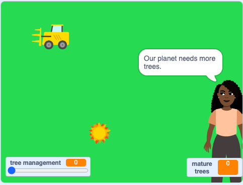

## చెట్ల స్థాయిలను పర్యవేక్షించండి

భూమిపై మన జీవన నాణ్యతకు చెట్లు చాలా ముఖ్యమైనవి. చెట్ల నుండి, ప్రజలు తినడానికి పండ్లు, ఆరోగ్యకరమైన జీవనానికి నూనెలు మరియు వాతావరణం నుండి ఆశ్రయం పొందుతారు. చెట్లు కార్బన్ డయాక్సైడ్‌ను గ్రహిస్తాయి మరియు ప్రపంచవ్యాప్తంగా విడుదలయ్యే CO2 రేటును తగ్గించడంలో సహాయపడతాయి. అవి అనేక రకాల జంతువులకు నిలయం. చెట్లు మన గ్రహాన్ని రక్షించడంలో సహాయపడతాయి!

ఈ దశలో, మీరు చెట్ల సంఖ్యను పర్యవేక్షించడానికి కోడ్‌ను జోడిస్తారు మరియు చెట్టు విస్తీర్ణం ఆరోగ్యంగా ఉందా లేదా చాలా చిన్నదిగా ఉందా అని చెప్పడానికి సందేశాలను జోడిస్తారు.

సిమ్యులేషన్ ప్రారంభమైనప్పుడు చెట్టు నిర్వహణ స్థాయిని సున్నాకి సెట్ చేయండి.

--- task ---

**Maya** sprite పై క్లిక్ చేయండి. కోడ్ ప్రాంతంలో ఇప్పటికే కొన్ని బ్లాక్‌లు ఉన్నట్లు మీరు చూస్తారు. ఇవి యూజర్ కోసం కొంత వచనంతో సిమ్యులేషన్ ప్రారంభించమని మాయకు చెబుతాయి. `set tree management to 0`{:class="block3variables"} బ్లాక్‌ ని జోడించండి.


```blocks3
when flag clicked
+ set [tree management v] to (0)
go to [front v] layer
say [Looking after trees slows down global warming & protects our planet] for (4) seconds
```

--- /task ---

సిమ్యులేషన్‌కి కోడ్‌ని జోడించండి, తద్వారా **Maya** sprite చెట్లన్నీ ఎప్పుడు పోయాయో చెబుతుంది.

--- task ---

`forever`{:class="block3control"} బ్లాకుని జోడించి, దాని లోపల `if ... then`{:class="block3control"} బ్లాకుని చొప్పించండి. `mature trees`{:class="block3variables"} `=`{:class="block3operators"} `0` కండిషన్ ను జోడించండి. `say for 2 seconds`{:class="block3looks"} బ్లాక్ ని జోడించండి మరియు `Our planet needs more trees.` ని టైప్ చేయండి:


```blocks3
when flag clicked
set [tree management v] to (0)
go to [front v] layer
say [Looking after trees slows down global warming & protects our planet.] for (4) seconds
+ forever
if {(mature trees) = [0]} then
say [Our planet needs more trees.] for (2) seconds
end
```



--- /task ---

CO2 స్థాయిలు ప్రమాదకరంగా కనిపిస్తే హెచ్చరికలు ఇవ్వడానికి శాస్త్రవేత్తలు తమ పరిశీలనలను ఉపయోగిస్తారు. తగినంత చెట్లు లేకుంటే **Maya** sprite హెచ్చరించేలా అలెర్ట్ ను జోడించండి.

పరిపక్వ చెట్ల సంఖ్య `0` కంటే ఎక్కువ మరియు `10` కంటే తక్కువగా ఉన్నప్పుడు కనిపించేలా సందేశాన్ని సెటప్ చేయండి.

--- task ---

`if`{:class="block3control"} బ్లాక్‌ ని `forever`{:class="block3looks"} బ్లాక్‌లో జోడించండి.

మీ గణన కోసం కొన్ని ఆపరేటర్‌లను జోడించండి. ముందుగా `and`{:class="block3operators"} బ్లాక్‌ని, ఆపై `greater than` {:class="block3operators"} బ్లాక్‌ని మరియు `less than`{:class="block3operators"} బ్లాక్‌ని జోడించండి. `mature trees`{:class="block3variables"} `greater than`{:class="block3operators"} `0` `and`{:class="block3operators"} `mature trees`{:class="block3variables"} `less than`{:class="block3operators"} `10` గణాంకాన్ని సెట్ చేయండి. `say`{:class="block3looks"} `Global warming is at dangerous levels.` `for 2 seconds`{:class="block3looks"} ని జోడించండి:


```blocks3
when flag clicked
set [tree management v] to (0)
go to [front v] layer
say [Looking after trees slows down global warming & protects our planet.] for (4) seconds
forever
if {(mature trees) = [0]} then
say [Our planet needs more trees.] for (2) seconds
end
+ if {{(mature trees)>[0]} and {(mature trees)<[10]}} then
say [Global warming is at dangerous levels.] for (2) seconds
end
end
```

--- /task ---

మరొక పరిశీలన సందేశాన్ని జోడించండి.

--- task ---

చివరి `if ... then`{:class="block3control"} బ్లాక్ పై రైట్-క్లిక్ చేయండి, మరియు మెను నుంచి **Duplicate** ను ఎంచుకోండి. మీ డుప్లికేటెడ్ బ్లాకులను చివరి `if ... then`{:class="block3control"} బ్లాక్ కింద జోడించండి, మరియు విలువలను `0` మరియు `10` నుండి `50` మరియు `60` కి మార్పు చేయండి. `say`{:class="block3looks"} బ్లాక్‌లో ప్రదర్శించడానికి హెచ్చరిక సందేశం గురించి ఆలోచించండి:


```blocks3
when flag clicked
set [tree management v] to (0)
go to [front v] layer
say [Looking after trees slows down global warming & protects our planet.] for (4) seconds
forever
if {(mature trees) = [0]} then
say [Our planet needs more trees.] for (2) seconds
end
if {{(mature trees)>[0]} and {(mature trees)<[10]}} then
say [Global warming is at dangerous levels.] for (2) seconds
end
+ if {{(mature trees)>[50]} and {(mature trees)<[60]}} then
say [Animals have many habitats.] for (2) seconds
end
end
```

--- /task ---

--- task ---

మీ సిమ్యులేషన్ ను పరీక్షించండి. చెట్ల సంఖ్య మీ `if ... then`{:class="block3control"} బ్లాకుల పరిధిలో వచ్చినపుడు, **Maya** sprite ఒక పరిశీలనాత్మక సందేశాన్ని చెబుతుంది.

--- /task ---

--- save ---
