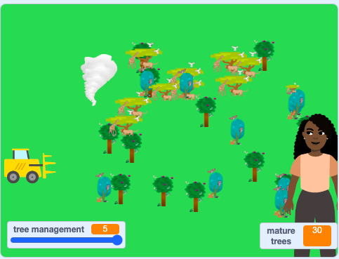

## సహజ అటవీ నిర్మూలన

కరువు, అడవి మంటలు లేదా సుడిగాలి వంటి ప్రకృతి విపత్తులు భూమిని నాశనం చేసినప్పుడు అటవీ నిర్మూలన జరుగుతుంది. ఇది క్యాంప్‌ఫైర్ వంటి మానవ కార్యకలాపాల ద్వారా కూడా ప్రేరేపించబడుతుంది, కానీ చాలా పొడి కాలం వంటి సహజ పరిస్థితుల కారణంగా త్వరగా వ్యాపిస్తుంది. ఇది ముఖ్యంగా ప్రాణాంతకం కావచ్చు, ఎందుకంటే ప్రభావితమైన విస్తృత ప్రాంతంలో, మొత్తం జాతులు, వాటి నివాసాలు నాశనం కావడంతో అదృశ్యమవుతాయి.

అడవిలో యాదృచ్ఛికంగా కదిలే ప్రకృతి వైపరీత్యాల ప్రభావాన్ని సిమ్యులేట్ చేయండి. సిమ్యులేషన్ ప్రారంభంలో **Natural Disaster** sprite ను దాచండి.

--- task ---

**Natural Disaster** sprite పై క్లిక్ చేయండి, తరువాత Code ప్రాంతంలో `when green flag clicked`{:class="block3events"} బ్లాక్, దాంతోపాటు `hide`{:class="block3looks"} బ్లాకుని జోడించండి:


```blocks3
when flag clicked
hide
```

--- /task ---

**Natural Disaster** sprite స్క్రీన్ పై నుండి క్రిందికి కదులుతుంది.

--- task ---

`forever`{:class="block3control"} బ్లాకుని మీ కోడ్ చివరకు జోఢించండి. అందులో `go to x:0 y:0`{:class="block3motion"} బ్లాక్ జోడించండి, మరియు `y:`{:class="block3motion"} విలువను `200` కి మార్చండి. `show`{:class="block3looks"} బ్లాక్ ని జోడించండి, దాని తర్వాత `glide 1 secs to x:0 y:0`{:class="block3motion"} ని జోడించండి, మరియు సెకండ్స్ విలువను `3` మరియు `y:`{:class="block3motion"} విలువను `-200` కు మార్చండి:


```blocks3
when flag clicked
hide
+ forever
go to x:(0) y:(200)
show
glide (3) secs to x:(0) y:(-200)
+ end
```

--- /task ---

**Natural Disaster** sprite, మూడు costumes కలిగి ఉంది: **Drought**, **Forest Fire**, మరియు **Tornado**, ఎందుకంటే చెట్లను అనేక రకాల ప్రకృతి వైపరీత్యాలు దెబ్బతీస్తాయి. సిమ్యులేషన్ బహుళ విపత్తు రకాలను కలిగి ఉండేలా కోడ్‌ని జోడించండి.

--- task ---

 Costumes వీక్షించడానికి **Costumes** ట్యాబ్‌పై క్లిక్ చేయండి. **Code** ట్యాబ్ ను తిరిగి క్లిక్ చేయండి మరియు అది స్క్రీన్ చివరకు చేరినప్పుడు, `hide`{:class="block3looks"} బ్లాకు, అనంతరం `next costume`{:class="block3looks"} బ్లాకుని జోడించండి:


```blocks3
when flag clicked
hide
forever
go to x:(0) y:(200)
show
glide (3) secs to x:(0) y:(-200)
+ hide
+ next costume
end
```

--- /task ---

--- task ---

మీ ప్రాజెక్ట్‌ను పరీక్షించండి. **Natural Disaster** sprite ఇప్పుడు పై నుండి క్రిందికి కదులుతుంది మరియు ప్రతిసారీ costume లను మారుస్తుంది.



--- /task ---

ప్రకృతి వైపరీత్యాలు ఎప్పుడు సంభవిస్తాయో శాస్త్రవేత్తలు కొన్నిసార్లు అంచనా వేయగలరు, అయితే ఇది కష్టంగా ఉంటుంది, ఎందుకంటే సిమ్యులేషన్ లో వలే కాకుండా అవి సంభవించే సమయం ఎల్లప్పుడూ స్పష్టంగా ఉండదు. **Natural Disaster** sprite కు యాదృచ్ఛిక సమయాన్ని జోడించి, నిజ జీవితంలో మాదిరిగా sprite రూపాన్ని అనూహ్యంగా మార్చండి.

--- task ---

సమయాన్ని యాదృచ్ఛికంగా సృష్టించడానికి, `wait 1 seconds`{:class="block3control"} బ్లాక్ ని మీ `forever`{:class="block3control"} బ్లాక్ పైన జోడించండి. `pick random`{:class="block3operators"} ఆపరేటర్ ని `wait`{:class="block3control"} బ్లాక్ లోనికి డ్రాగ్ చేయండి, మరియు విలువలను `10` ఇంకా `20` కి మార్చండి:


```blocks3
when flag clicked
hide
forever
+ wait (pick random (10) to (20)) seconds
go to x:(0) y:(200)
show
glide (3) secs to x:(0) y:(-200)
hide
next costume
end
```

--- /task ---

**Natural Disaster** sprite కదలికకు యాదృచ్ఛికతను జోడించండి.

--- task ---

`pick random`{:class="block3operators"} ఆపరేటర్‌ని `go to`{:class="block3motion"} బ్లాక్ మరియు `glide`{:class="block3motion"} బ్లాక్ యొక్క `x:`{:class="block3motion"} అక్షాంశాలలోనికి డ్రాగ్ చేయండి. ప్రతి దానిలోని విలువలను `-200` మరియు `200`కి మార్చండి:


```blocks3
when flag clicked
hide
forever
wait (pick random (10) to (20)) seconds
+ go to x:(pick random (-200) to (200)) y:(200)
show
+ glide (3) secs to x:(pick random (-200) to (200)) y:(-200)
hide
next costume
end
```

--- /task ---

--- task ---

మీ ప్రాజెక్ట్‌ను మళ్లీ పరీక్షించండి. మీ **Natural Disaster** sprite ఇప్పుడు ఒక యాదృచ్ఛిక స్థానం నుండి మరొక యాదృచ్ఛిక స్థానానికి పడిపోయే ముందు 10 మరియు 20 సెకన్ల మధ్య వేచి ఉండాలి. ఇది ప్రతిసారీ costume మారుస్తుంది మరియు తాకిన చెట్లను తొలగిస్తుంది.

--- /task ---

--- save ---
